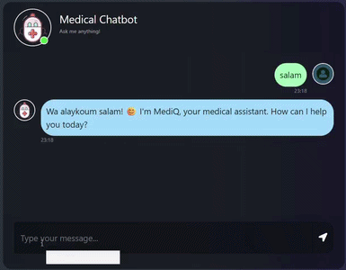
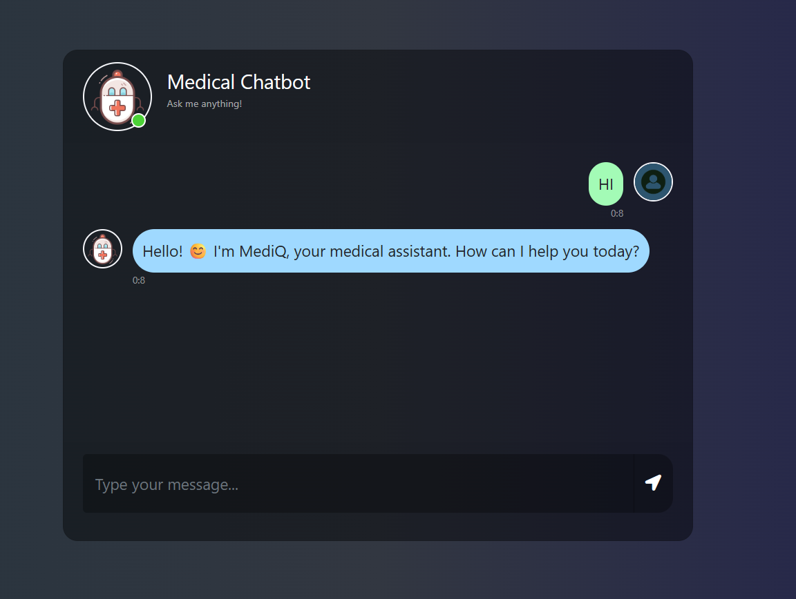

<div align="center">

<h1>🏥 MediQ — Medical Chatbot</h1>

<p><strong>A production-ready medical Q&A chatbot powered by Llama 2, Pinecone, and LangChain — with a custom Flask web interface</strong></p>

[](https://python.org)
[](https://flask.palletsprojects.com)
[](https://langchain.com)
[](https://pinecone.io)
[](https://ai.meta.com/llama)
[](LICENSE)

<br/>

<p>
Ask any medical question in any language — get grounded, source-backed answers<br/>
from a <strong>locally-running Llama 2 model</strong>, no OpenAI API needed.
</p>

<!-- STEP 1: record a GIF with ScreenToGif showing: salam → answer → heart attack question → thank you -->
<!-- upload it to docs/images/demo.gif -->


</div>

---

## 🌟 What Makes This Project Different

Most RAG chatbots are just notebooks. This one is a **deployed full-stack application**:

- 🌐 **Real web interface** — custom dark-theme chat UI, no Streamlit or Gradio
- 🧠 **Runs 100% locally** — Llama 2 7B on your machine, zero cloud LLM costs
- 🔒 **Faithful RAG** — answers only from retrieved medical context, never hallucinating
- 💬 **Multilingual greetings** — responds to salam, hello, bonjour, السلام عليكم
- 📦 **Proper Python package** — `src/` module with clean separation of concerns

---

## 🗺️ Architecture

```
┌─────────────────────────────────────────────────┐
│           Medical PDF Knowledge Base             │
│        (loaded, chunked, embedded once)          │
└─────────────────┬───────────────────────────────┘
                  │  store_index.py (run once)
                  ▼
     ┌────────────────────────┐
     │   Pinecone Vector DB   │  sentence-transformers/all-MiniLM-L6-v2
     │   (384-dim, cosine)    │  9,826 chunks indexed
     └────────────┬───────────┘
                  │  top-1 most relevant chunk retrieved
                  ▼
     ┌────────────────────────┐
     │   LangChain RetrievalQA│  context injected into prompt
     └────────────┬───────────┘
                  │
                  ▼
     ┌────────────────────────┐
     │   Llama 2 7B (local)   │  CTransformers GGML quantized
     │   CPU inference        │  temperature: 0.5
     └────────────┬───────────┘
                  │
                  ▼
     ┌────────────────────────┐
     │    Flask Web App       │  served at localhost:8080
     │    POST /get           │  AJAX — no page reload
     └────────────────────────┘
```

---

## 💬 Demo

<!-- STEP 2: upload 2-3 screenshots to docs/images/ showing the chat in action -->

<div align="center">
  
  
</div>

<br/>

| User says | MediQ responds |
|---|---|
| *"salam"* | "Wa alaykoum salam! 😊 I'm MediQ, how can I help you today?" |
| *"what causes a heart attack?"* | Concise, grounded answer from medical knowledge base |
| *"thank you so much"* | "My pleasure! 💙 Stay healthy and feel free to ask anytime." |
| *"what is X?"* (not in KB) | "I'm not sure, please consult a doctor. 🏥" |

> **Faithful by design:** greetings and small talk are handled directly without touching the LLM. Medical questions go through RAG — if the knowledge base doesn't have the answer, MediQ says so honestly instead of hallucinating.

---

## 🔬 Project Breakdown

### Data Ingestion (`store_index.py`)

Run once to build the vector index:

1. Load all PDFs from `data/` using `PyPDFLoader`
2. Split into chunks: `chunk_size=300`, `chunk_overlap=20` → **9,826 chunks**
3. Embed with `sentence-transformers/all-MiniLM-L6-v2` (384 dimensions)
4. Store in **Pinecone Serverless** (AWS `us-east-1`, cosine similarity)

### Source Module (`src/`)

Clean, reusable Python package:

```
src/
├── __init__.py
├── helper.py    # PDF loading, text splitting, embeddings
└── prompt.py    # RAG prompt template
```

**`helper.py`** — three focused utilities:
```python
load_pdf(data)                     # Load all PDFs from a directory
text_split(extracted_data)         # Chunk documents (300 tokens, 20 overlap)
download_hugging_face_embeddings() # Load all-MiniLM-L6-v2
```

**`prompt.py`** — strict, concise RAG prompt:
```
You are MediQ, a concise and friendly medical assistant.
Answer in 2-3 sentences maximum using ONLY the context.
If not found → "I'm not sure, please consult a doctor."
```

### Smart Conversation Routing (`app.py`)

Greetings, thanks, and goodbyes are caught **before** reaching the LLM — instant responses, no wasted inference:

```python
if q_lower in ["salam", "hello", "hi", ...]:
    return "Wa alaykoum salam! 😊 ..."  # instant

if q_lower in ["thank you", "shukran", ...]:
    return "My pleasure! 💙 ..."         # instant

# Only medical questions reach the LLM
result = qa.invoke({"query": user_question})
```

### Chat UI (`templates/chat.html` + `static/style.css`)

Built from scratch — no template used:
- Dark gradient background (custom CSS)
- Bubble-style messages (blue for bot, green for user)
- Real-time AJAX — no page reload on send
- Timestamps on every message
- Fully responsive with Bootstrap 4

---

## 📁 Project Structure

```
mediq/
├── src/
│   ├── __init__.py
│   ├── helper.py              # PDF loading, chunking, embeddings
│   └── prompt.py              # RAG prompt template
├── templates/
│   └── chat.html              # Chat web interface
├── static/
│   └── style.css              # Custom dark theme
├── docs/
│   └── images/                # Screenshots and GIF for this README
├── model/
│   └── llama-2-7b-chat.ggmlv3.q2_K.bin  # Local model (git-ignored)
├── data/                      # Medical PDFs (git-ignored)
├── app.py                     # Flask app + conversation routing
├── store_index.py             # One-time vector index builder
├── setup.py
├── requirements.txt
└── .env                       # API keys (git-ignored)
```

---

## ⚙️ Tech Stack

| Layer | Technology |
|---|---|
| **LLM** | Llama 2 7B Chat (GGML quantized, local via CTransformers) |
| **Embeddings** | `sentence-transformers/all-MiniLM-L6-v2` (384-dim) |
| **Vector Database** | Pinecone Serverless (AWS us-east-1, cosine similarity) |
| **RAG Framework** | LangChain `RetrievalQA` + `PromptTemplate` |
| **Web Framework** | Flask |
| **Frontend** | HTML, CSS, Bootstrap 4, jQuery AJAX |
| **PDF Processing** | `PyPDFLoader`, `RecursiveCharacterTextSplitter` |

---

## 🚀 Getting Started

### 1. Clone the repo
```bash
git clone https://github.com/houdhoudGH/mediq.git
cd mediq
```

### 2. Create virtual environment
```bash
python -m venv .venv
source .venv/bin/activate      # Windows: .venv\Scripts\activate
pip install -r requirements.txt
```

### 3. Set up environment variables
Create a `.env` file:
```
PINECONE_API_KEY=your-pinecone-api-key
```

### 4. Download the Llama 2 model
Download `llama-2-7b-chat.ggmlv3.q2_K.bin` from [HuggingFace](https://huggingface.co/TheBloke/Llama-2-7B-Chat-GGML) and place it in `model/`.

### 5. Add your medical PDFs
Place PDF files in the `data/` folder.

### 6. Build the vector index (run once)
```bash
python store_index.py
```

### 7. Run the app
```bash
# Set SSL cert first (Windows)
$env:SSL_CERT_FILE="path\to\.venv\lib\site-packages\certifi\cacert.pem"

python app.py
```

Open `http://localhost:8080` 🚀

---

## 🔮 Future Work

- [ ] Streaming responses for real-time token output
- [ ] Source citation — show which PDF page the answer came from
- [ ] Deploy to cloud (Render, Railway, or HuggingFace Spaces)
- [ ] Upgrade to Llama 3 for better answer quality
- [ ] Add conversation memory for multi-turn dialogue
- [ ] Support voice input

---

## 📄 License

MIT — see [LICENSE](LICENSE) for details.

---

<div align="center">

**Built by [Houda](https://github.com/houdhoudGH)**
*· Master 2 Data Science & NLP · AI Engineer ·*

<br/>
<sub>Llama 2 · LangChain · Pinecone · Flask · sentence-transformers · CTransformers</sub>

</div>
