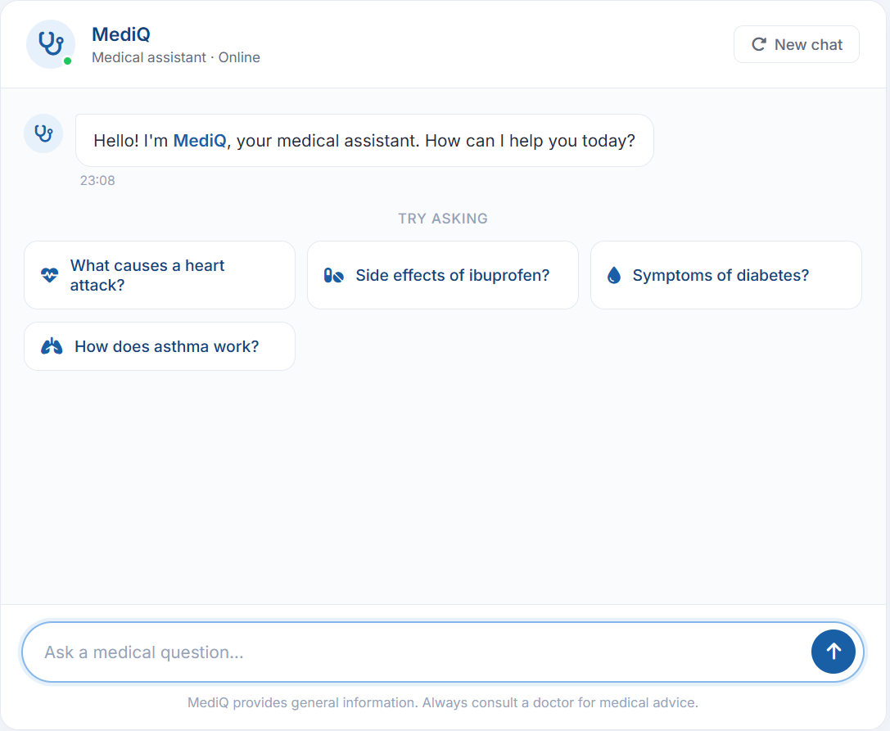

<div align="center">

<h1>🏥 MediQ — Medical Chatbot</h1>

<p><strong>A production-ready medical Q&A chatbot with a deterministic safety layer<br/>powered by Llama 2, Pinecone, LangChain, and a custom Flask web interface</strong></p>

[](https://python.org)
[](https://flask.palletsprojects.com)
[](https://langchain.com)
[](https://pinecone.io)
[](https://ai.meta.com/llama)
[](LICENSE)

<br/>

<p>
Ask any medical question in any language — get grounded, source-backed answers<br/>
from a <strong>locally-running Llama 2 model</strong>, with a rule-based safety net<br/>
that catches dangerous inputs <em>before</em> they reach the model.
</p>

</div>

---

## 💬 See it in action

<div align="center">

<table>
<tr>
<td width="50%">

<p align="center"><em>Clean welcome screen with starter prompts</em></p>
</td>
<td width="50%">

<p align="center"><em>Grounded answers from the medical knowledge base</em></p>
</td>
</tr>
<tr>
<td width="50%">

<p align="center"><em>Markdown rendering + typing indicator during inference</em></p>
</td>
<td width="50%">

<p align="center"><em><strong>Safety layer:</strong> pushes back on dangerous quantities</em></p>
</td>
</tr>
</table>

</div>

---

## 🌟 What makes this project different

Most RAG chatbots are notebooks. MediQ is a **deployed full-stack application** with engineering choices a real medical product would make:

- 🛡️ **Deterministic safety layer** — high-risk inputs (overdose-level medication quantities, prolonged fasting, emergency symptoms, stopping prescription drugs) are caught by **rule-based handlers before reaching the LLM**, ensuring consistent, instant, locally-relevant warnings (e.g. Algerian emergency numbers 14 / 1548)
- 🌐 **Real web interface** — custom clinical white-and-blue chat UI built from scratch, no Streamlit or Gradio
- 🧠 **Runs 100% locally** — Llama 2 7B on CPU, zero cloud LLM costs, no OpenAI API
- 🔒 **Grounded RAG** — answers anchored in 9,826 medical chunks indexed in Pinecone
- 💬 **Multilingual** — handles English, French, and Arabic / Darija greetings
- 📝 **Markdown rendering** — bot answers support bold, lists, and inline code
- 📦 **Proper Python package** — `src/` module with clean separation of concerns

---

## 🛡️ The safety layer — why it matters

Pure RAG chatbots have a known failure mode: they give bland, agreeable answers to dangerous inputs. Ask a small quantized Llama 2 *"should I drink 10 liters of water a day?"* and it will politely list general hydration advice — completely missing that 10L can cause life-threatening **hyponatremia**.

MediQ solves this with a **two-tier architecture**:

```
                  ┌──────────────────────────┐
   User input ──▶ │ Tier 1: Safety patterns  │ ──▶  match? ──▶ instant response
                  │ (regex, rule-based)      │
                  └──────────────────────────┘
                              │ no match
                              ▼
                  ┌──────────────────────────┐
                  │ Tier 2: RAG + LLM        │ ──▶  grounded answer
                  │ (Pinecone + Llama 2)     │
                  └──────────────────────────┘
```

**What the safety layer catches:**

| Pattern | Example trigger | Why it matters |
|---|---|---|
| Excessive water | *"how much water? 10L?"* | Hyponatremia — sodium imbalance, seizures |
| Paracetamol overdose | *"can I take 20 paracetamol?"* | Liver failure — silent at first |
| Ibuprofen overdose | *"6 advil for my back pain"* | GI bleeding, kidney damage |
| Prolonged fasting | *"fasting for 7 days"* | Muscle wasting, cardiac arrhythmia |
| Stopping prescription meds | *"I want to stop my metformin"* | Diabetic complications, resistant infections |
| Emergency symptoms | *"chest pain radiating to arm"* | Time-critical — Algerian SAMU (14) shown |

This pattern (deterministic safety rules in front of an LLM) is what real medical AI products use. It's faster than LLM inference, more reliable than prompt engineering, and easy to audit.

---

## 🗺️ Architecture

```
┌─────────────────────────────────────────────────┐
│           Medical PDF Knowledge Base             │
│        (loaded, chunked, embedded once)          │
└─────────────────┬───────────────────────────────┘
                  │  store_index.py (run once)
                  ▼
     ┌────────────────────────┐
     │   Pinecone Vector DB   │  sentence-transformers/all-MiniLM-L6-v2
     │   (384-dim, cosine)    │  9,826 chunks indexed
     └────────────┬───────────┘
                  │
                  │  User question arrives
                  ▼
     ┌────────────────────────┐
     │   Safety layer (regex) │  catches dangerous inputs instantly
     │   ─ overdose quantities│  no LLM inference needed
     │   ─ emergency symptoms │
     │   ─ stopping meds      │
     └────────────┬───────────┘
                  │  passed through if safe
                  ▼
     ┌────────────────────────┐
     │   LangChain RetrievalQA│  top-3 chunks retrieved
     └────────────┬───────────┘
                  │
                  ▼
     ┌────────────────────────┐
     │   Llama 2 7B (local)   │  CTransformers GGML quantized
     │   CPU inference        │  temp 0.4, 256 max tokens
     └────────────┬───────────┘
                  │
                  ▼
     ┌────────────────────────┐
     │    Flask Web App       │  served at localhost:8080
     │    POST /get           │  AJAX, markdown rendered
     └────────────────────────┘
```

---

## 🔬 Project breakdown

### Data ingestion (`store_index.py`)

Run once to build the vector index:

1. Load all PDFs from `data/` using `PyPDFLoader`
2. Split into chunks: `chunk_size=300`, `chunk_overlap=20` → **9,826 chunks**
3. Embed with `sentence-transformers/all-MiniLM-L6-v2` (384 dimensions)
4. Store in **Pinecone Serverless** (AWS `us-east-1`, cosine similarity)

### Source module (`src/`)

```
src/
├── __init__.py
├── helper.py    # PDF loading, text splitting, embeddings
└── prompt.py    # RAG prompt template
```

**`helper.py`** — three focused utilities:

```python
load_pdf(data)                     # Load all PDFs from a directory
text_split(extracted_data)         # Chunk documents (300 tokens, 20 overlap)
download_hugging_face_embeddings() # Load all-MiniLM-L6-v2
```

**`prompt.py`** — instructs the LLM to use retrieved context as the main source, allows general medical knowledge when context is thin, and reserves "consult a doctor" for genuinely personal questions (specific dosage, lab results, diagnosis) instead of using it as a catch-all refusal.

### Request flow (`app.py`)

Three tiers, each one cheaper than the last:

```python
# Tier 0: exact-match greetings, thanks, goodbyes — instant
if q_lower in ["salam", "hello", ...]:
    return "Wa alaykoum salam! 😊 ..."

# Tier 1: safety patterns (regex) — instant, deterministic
safety_response = check_safety_patterns(q_lower)
if safety_response:
    return safety_response

# Tier 2: medical question → RAG + LLM
result = qa.invoke({"query": user_question})
```

### Chat UI (`templates/chat.html` + `static/style.css`)

Built from scratch — no Bootstrap, no template:

- Clean clinical theme (white card, soft blue accents)
- Asymmetric bubble corners (sharper "tail" corner makes user vs. bot instantly readable)
- **Typing indicator** with animated dots while the LLM thinks
- **Markdown rendering** for bot answers via `marked.js`
- **Starter prompts** on first load — hide after the first user message
- **"New chat"** button to reset the conversation
- Smooth fade-in animations, custom scrollbar, focus ring on input
- Fully responsive — on mobile it goes full-screen and starters stack to one column

---

## 📁 Project structure

```
mediq/
├── src/
│   ├── __init__.py
│   ├── helper.py              # PDF loading, chunking, embeddings
│   └── prompt.py              # RAG prompt template
├── templates/
│   └── chat.html              # Chat web interface
├── static/
│   └── style.css              # Custom clinical theme
├── docs/
│   └── images/                # Screenshots for this README
├── model/
│   └── llama-2-7b-chat.ggmlv3.q2_K.bin  # Local model (git-ignored)
├── data/                      # Medical PDFs (git-ignored)
├── app.py                     # Flask app + safety layer + routing
├── store_index.py             # One-time vector index builder
├── setup.py
├── requirements.txt
└── .env                       # API keys (git-ignored)
```

---

## ⚙️ Tech stack

| Layer | Technology |
|---|---|
| **LLM** | Llama 2 7B Chat (GGML quantized, local via CTransformers) |
| **Embeddings** | `sentence-transformers/all-MiniLM-L6-v2` (384-dim) |
| **Vector Database** | Pinecone Serverless (AWS us-east-1, cosine similarity) |
| **RAG Framework** | LangChain `RetrievalQA` + `PromptTemplate` |
| **Safety Layer** | Pure Python regex — deterministic, auditable, zero latency |
| **Web Framework** | Flask + AJAX |
| **Frontend** | Vanilla JS, custom CSS, FontAwesome 6, `marked.js` |
| **PDF Processing** | `PyPDFLoader`, `RecursiveCharacterTextSplitter` |

---

## 🚀 Getting started

### 1. Clone the repo
```bash
git clone https://github.com/houdhoudGH/mediq.git
cd mediq
```

### 2. Create virtual environment
```bash
python -m venv .venv
source .venv/bin/activate      # Windows: .venv\Scripts\activate
pip install -r requirements.txt
```

### 3. Set up environment variables
Create a `.env` file:
```
PINECONE_API_KEY=your-pinecone-api-key
```

### 4. Download the Llama 2 model
Download `llama-2-7b-chat.ggmlv3.q2_K.bin` from [HuggingFace](https://huggingface.co/TheBloke/Llama-2-7B-Chat-GGML) and place it in `model/`.

> 💡 **Tip:** For noticeably better answers, use `llama-2-7b-chat.ggmlv3.q4_K_M.bin` instead (~4GB instead of ~2.8GB) and update the path in `app.py`.

### 5. Add your medical PDFs
Place PDF files in the `data/` folder.

### 6. Build the vector index (run once)
```bash
python store_index.py
```

### 7. Run the app
```bash
python app.py
```

> SSL certificates are now handled automatically via `certifi` — no manual environment variable needed.

Open [http://localhost:8080](http://localhost:8080) 🚀

---

## 🔮 Future work

- [ ] Streaming responses for real-time token output
- [ ] Source citation — show which PDF page the answer came from
- [ ] Deploy to cloud (Render, Railway, or HuggingFace Spaces)
- [ ] Upgrade to Llama 3 or Mistral 7B for better answer quality
- [ ] Add conversation memory for multi-turn dialogue
- [ ] Expand safety layer with more clinical patterns (pediatric dosing, pregnancy interactions)
- [ ] Support voice input

---

## 📄 License

MIT — see [LICENSE](LICENSE) for details.

---

<div align="center">

**Built by [Houda](https://github.com/houdhoudGH)**
*· Master 2 Data Science & NLP · AI Engineer ·*

<br/>
<sub>Llama 2 · LangChain · Pinecone · Flask · sentence-transformers · CTransformers</sub>

</div>